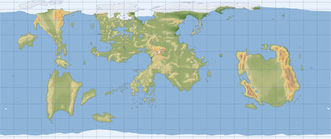

# Toril GIS
***The Source for Forgotten Realms Geospatial Data***

The **Toril GIS** project, part of [Geospatial Grimoire](https://geospatial-grimoire.com/), is building an open geospatial database for the Forgotten Realms. Using free and open-source [QGIS software](https://www.qgis.org/), we digitize maps and lore to create an interactive and data-rich representation of Toril. Our goal is to empower Dungeon Masters and players with geospatial tools to explore, visualize, and expand the Realms in exciting new ways.

### What’s Coming Next?

While the project is still in active development, we are laying the foundation for a QGIS-based mapping package that users will eventually be able to download and run on their own computers. This package will include ready-to-use spatial layers, styles, and metadata—allowing for exploration, analysis, and customization.

Stay tuned for updates and insights on our blog: [Geospatial Grimoire Blog](https://www.geospatial-grimoire.com/blog/)

## Usage Terms

Toril GIS is unofficial Fan Content based on materials from Wizards of the Coast. See [Usage Terms](/USAGE_TERMS.md) for details.
