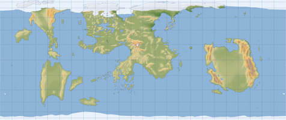

# Toril GIS: The Source for Forgotten Realms Geospatial Data

**Toril GIS** is an open, fan-made geospatial database of the *Forgotten Realms*, built on top of the legendary *Forgotten Realms Interactive Atlas*. It aims to become the most accurate and richly detailed digital map of *Toril* — including *Faerûn* and other continents — for exploration, cartography, and analysis in GIS environments.

This repository is part of the [**Geospatial Grimoire**](https://www.geospatial-grimoire.com/) initiative — where maps come alive and worlds take shape.

---

## Project Status

**🛠️ Actively in development (2025)**
Toril GIS is being built layer by layer. Most datasets, styles, and exports are still in preparation, and new material is being added continuously. Expect structure and documentation to evolve as the foundation stabilizes.

> It may look empty, but there’s a lot happening behind the scenes — the datasets are being prepared and refined before release. GIS work is complex enough on its own, so we’d rather publish clean, well-structured data than rush unfinished layers.

---

## Quick Overview

- **Goal:** A full open-source GIS dataset of Toril, compatible with QGIS and PostGIS
- **Focus:** Accuracy, interoperability, and multilingual support
- **Current phase:** Core data modeling, coordinate systems, and foundational layers
- **Next steps:** Data population, symbology refinement, and export pipelines

---

## Repository Structure

### `gis/`
Main geospatial content — CRS definitions, layers, and QGIS project files.

### `exports/`
Simplified or preprocessed files for future public sharing.

### `resources/`
Supporting reference material and internal assets.

### Root files
- `README.md` — this document
- `USAGE_TERMS.md` — detailed license and attribution information

---

## Documentation

Project notes, specifications, and technical details can be found in the [**Toril GIS Wiki**](https://github.com/geospatial-grimoire/toril-gis/wiki).

For broader updates and development insights, visit the [**Geospatial Grimoire Blog**](https://www.geospatial-grimoire.com/blog/).

---

## Community & Contributions

Toril GIS is a fan-driven, non-commercial project under active construction.
Contributors are welcome — especially those with GIS experience, localization expertise, or a passion for worldbuilding. You can join discussions in the [**Discussions section**](https://github.com/geospatial-grimoire/toril-gis/discussions).

---

## License & Usage

Toril GIS includes original work, fan-made content, and derivative datasets.
See [**Usage Terms**](/USAGE_TERMS.md) for details on reuse and attribution.
