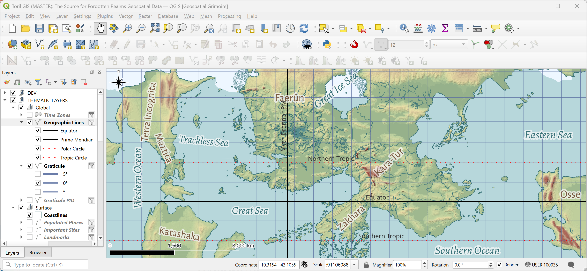

# Toril GIS: Editable Offline Map of the Forgotten Realms

> **Data updated: 2026-07-30**

**Toril GIS** is a downloadable QGIS project and geospatial database of the Forgotten Realms. It aims to provide a detailed and geographically consistent digital representation of Toril - including Faerûn and other continents - for exploration, cartography, spatial analysis, and the creation of custom maps.

The repository is part of [**Geospatial Grimoire**](https://www.geospatial-grimoire.com/), an initiative focused on applying geospatial methods and technologies to fictional worlds.

> Toril GIS is unofficial Fan Content permitted under the [Wizards of the Coast Fan Content Policy](https://company.wizards.com/en/legal/fancontentpolicy). It is not approved or endorsed by Wizards of the Coast. Portions of the materials used are property of Wizards of the Coast. © Wizards of the Coast LLC.

## Download

To download Toril GIS as a ZIP archive:

1. Select the green **Code** button above the repository file list.
2. Select **Download ZIP**.
3. Extract the downloaded archive on your computer.

After downloading, follow the [**First Time Setup guide**](https://www.geospatial-grimoire.com/worlds/toril/gis/docs/first-time-setup/) for instructions on installing the required software, opening the QGIS project, and configuring its data.

## Project Status

**Actively in development**

The GIS data available in this repository represents a snapshot of the evolving Toril GIS database.

At global and macro-regional scales, the main geographic structure is already in place and can be used for broad exploration, spatial analysis, and cartography.

More detailed regional and local data is still being added and refined. Some locations, geometries, attributes, and geographic relationships may therefore be incomplete, approximate, inconsistent, or incorrect.

Follow [**Geospatial Grimoire on Patreon**](https://members.geospatial-grimoire.com/) to keep up with updates about Toril GIS, Toril Explorer, and other related projects. Project updates are available to free followers.

## Documentation

See the [**Toril GIS documentation**](https://www.geospatial-grimoire.com/worlds/toril/gis/docs/) for:

- installation and setup instructions;
- information about the project structure;
- descriptions of the available data and layers;
- QGIS usage guidance;
- project-specific tools and workflows.

## Repository Structure

### `gis/`

The main QGIS workspace, including the QGIS project, GeoPackage database, and other files used as GIS layers.

### `exports/`

Individual layers exported from the QGIS project in formats intended for use outside the main Toril GIS workspace.

### `releases/`

Metadata for published Toril GIS versions, including manifests, changelogs, release notes, and checksums.

### `resources/`

Supporting project resources, including CRS definitions, QGIS styles, reference material, and repository images.

## Related Project

The data prepared in Toril GIS also powers [**Toril Explorer**](https://www.geospatial-grimoire.com/worlds/toril/explorer/), a browser-based interactive map for exploring Toril without installing GIS software.

## Feedback & Contributions

Feedback and contributions are welcome, particularly from people with experience in GIS, cartography, data management, Forgotten Realms lore, or worldbuilding.

Use the [**Geospatial Grimoire feedback form**](https://forms.gle/JE8V9JrxNyELNCsz7) to report problems, suggest improvements, ask questions, or share how you are using Toril GIS.

## Usage Terms

Toril GIS is made available for free, non-commercial fan use under the Wizards of the Coast [Fan Content Policy](https://company.wizards.com/en/legal/fancontentpolicy).

Any derivative work based on Toril GIS that uses or incorporates Wizards of the Coast intellectual property must also comply with the Fan Content Policy.

### Attribution

Attribution to Geospatial Grimoire is not required, but it is appreciated. Suggested attribution:

> Toril GIS by Geospatial Grimoire
> https://www.geospatial-grimoire.com/worlds/toril/gis/